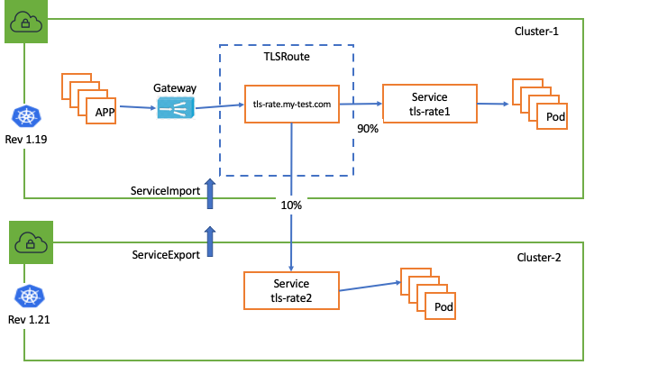

# TLS Passthrough Support (alpha)

[Kubernetes Gateway API](https://gateway-api.sigs.k8s.io/guides/tls/) lays out the general guidelines on how to configure TLS passthrough. Here are examples on how to use them against AWS VPC Lattice.

## Upgrade Controller

### Install gateway API TLSRoute CRD

Here is [TLSRoute CRD](https://github.com/liwenwu-amazon/aws-application-networking-k8-publics/blob/tls-route-support/config/crds/bases/gateway.networking.k8s.io_tlsroutes.yaml).


Here is alpha branch repo: https://github.com/liwenwu-amazon/aws-application-networking-k8-publics/tree/tls-route-support

```
# clone the TLS support alpha repo
git clone git@github.com:liwenwu-amazon/aws-application-networking-k8-publics.git

# install CRD
kubectl apply -f config/crds/bases/gateway.networking.k8s.io_tlsroutes.yaml

# Verfiy TLSRoute CRD 
kubectl get crd tlsroutes.gateway.networking.k8s.io 
NAME                                  CREATED AT
tlsroutes.gateway.networking.k8s.io   2024-03-07T23:16:22Z

```

### Upgrade Controller Image

```
kubectl apply -f example/deploy-v1.0.3-tls.yaml
```

## Setup

### Configure TLS Passthrough Listener on Gateway

```
kubectl apply -f examples/gateway-tls-passthrough.yaml
```

```
# tls listener config snips ...
apiVersion: gateway.networking.k8s.io/v1beta1
kind: Gateway
metadata:
  name: my-hotel-tls
spec:
  gatewayClassName: amazon-vpc-lattice
  listeners:
  ...
  - name: tls
    protocol: TLS 
    port: 443
    tls:
      mode: Passthrough 
  ...
```

### Configure TLSRoute

```
# configure nginx backend
kubectl apply -f example/nginx-tls.yaml

# configure nginx tls route
kubectl apply -f examples/nginx-route-tls.yaml


```

```
# Verfiy controller has reconciled nginx-tls route
kubectl get tlsroute nginx-tls -o yaml
apiVersion: gateway.networking.k8s.io/v1alpha2
kind: TLSRoute
metadata:
  annotations:
    application-networking.k8s.aws/lattice-assigned-domain-name: nginx-tls-default-0ddade421111c485e.7d67968.mercury-svcs-gamma.us-west-2.on.aws
    ...
  name: nginx-tls
  namespace: default
 ...


```

```
# Verify TLS Passthrough Traffic 
kubectl get pod
NAME                           READY   STATUS    RESTARTS       AGE
app-694bb8f486-49rv4           1/1     Running   3 (5d9h ago)   26d
app-694bb8f486-jsqjk           1/1     Running   3 (5d9h ago)   26d

kubectl exec -ti app-694bb8f486-49rv4   sh
kubectl exec [POD] [COMMAND] is DEPRECATED and will be removed in a future version. Use kubectl exec [POD] -- [COMMAND] instead.

# using lattice created domain name
sh-4.2# curl -k -v https://nginx-tls-default-0ddade421111c485e.7d67968.mercury-svcs-gamma.us-west-2.on.aws
*   Trying 169.254.171.32:443...
* Connected to nginx-tls-default-0ddade421111c485e.7d67968.mercury-svcs-gamma.us-west-2.on.aws (169.254.171.32) port 443 (#0)
* ALPN, offering h2
* ALPN, offering http/1.1
* Cipher selection: ALL:!EXPORT:!EXPORT40:!EXPORT56:!aNULL:!LOW:!RC4:@STRENGTH
* successfully set certificate verify locations:
*  CAfile: /etc/pki/tls/certs/ca-bundle.crt
*  CApath: none
* TLSv1.2 (OUT), TLS header, Certificate Status (22):
* TLSv1.2 (OUT), TLS handshake, Client hello (1):
* TLSv1.2 (IN), TLS handshake, Server hello (2):
* TLSv1.2 (IN), TLS handshake, Certificate (11):
* TLSv1.2 (IN), TLS handshake, Server key exchange (12):
* TLSv1.2 (IN), TLS handshake, Server finished (14):
* TLSv1.2 (OUT), TLS handshake, Client key exchange (16):
* TLSv1.2 (OUT), TLS change cipher, Change cipher spec (1):
* TLSv1.2 (OUT), TLS handshake, Finished (20):
* TLSv1.2 (IN), TLS change cipher, Change cipher spec (1):
* TLSv1.2 (IN), TLS handshake, Finished (20):
* SSL connection using TLSv1.2 / ECDHE-RSA-AES256-GCM-SHA384
* ALPN, server accepted to use h2
* Server certificate:
*  subject: C=US; ST=wa; L=seattle; O=aws; OU=lattice; CN=liwen.ssl-test.com; emailAddress=liwenwu@amazon.com
*  start date: Mar  5 21:26:24 2024 GMT


# use customer defined name
curl -k -v https://nginx-test.my-test.com --resolve nginx-test.my-test.com:443:169.254.171.32
* Added nginx-test.my-test.com:443:169.254.171.32 to DNS cache
* Hostname nginx-test.my-test.com was found in DNS cache
*   Trying 169.254.171.32:443...
* Connected to nginx-test.my-test.com (169.254.171.32) port 443 (#0)
* ALPN, offering h2
* ALPN, offering http/1.1
* Cipher selection: ALL:!EXPORT:!EXPORT40:!EXPORT56:!aNULL:!LOW:!RC4:@STRENGTH
* successfully set certificate verify locations:
*  CAfile: /etc/pki/tls/certs/ca-bundle.crt
*  CApath: none
* TLSv1.2 (OUT), TLS header, Certificate Status (22):
* TLSv1.2 (OUT), TLS handshake, Client hello (1):
* TLSv1.2 (IN), TLS handshake, Server hello (2):
* TLSv1.2 (IN), TLS handshake, Certificate (11):
* TLSv1.2 (IN), TLS handshake, Server key exchange (12):
* TLSv1.2 (IN), TLS handshake, Server finished (14):
* TLSv1.2 (OUT), TLS handshake, Client key exchange (16):
* TLSv1.2 (OUT), TLS change cipher, Change cipher spec (1):
* TLSv1.2 (OUT), TLS handshake, Finished (20):
* TLSv1.2 (IN), TLS change cipher, Change cipher spec (1):
* TLSv1.2 (IN), TLS handshake, Finished (20):
* SSL connection using TLSv1.2 / ECDHE-RSA-AES256-GCM-SHA384
* ALPN, server accepted to use h2
* Server certificate:
*  subject: C=US; ST=wa; L=seattle; O=aws; OU=lattice; CN=liwen.ssl-test.com; emailAddress=liwenwu@amazon.com


```

### Configure TLSRoute span multiple Kubernetes Clusters



```
# cluster-1
# create tls-rate1 Kubernetes Service
kubectl apply -f examples/tls-rate1.yaml

```

#### Configure ServieExport using TCP protocol in cluster2 

```
# cluster-2
# create tls-rate2 Kubernetes Service
kubectl apply -f examples/tls-rate2.yaml

# create serviceexport
kubectl apply -f examples/tls-rate2-export.yaml

# create targetgroup policy to configure TCP protocol  for tls-rate2
kubectl apply -f examples/tls-rate-policy.yaml

```

```
# snips of serviceexport config
apiVersion: application-networking.k8s.aws/v1alpha1
kind: ServiceExport
metadata:
  name: tls-rate-2
  annotations:
    application-networking.k8s.aws/federation: "amazon-vpc-lattice"

# snips of targetgroup policy config
apiVersion: application-networking.k8s.aws/v1alpha1
kind: TargetGroupPolicy
metadata:
    name: tls-rate2
spec:
    targetRef:
        group: "application-networking.k8s.aws"
        kind: ServiceExport
        name: tls-rate2
    protocol: TCP
    protocolVersion: HTTP1    

```

#### Configure ServiceImport in cluster1 

```
kubectl apply -f examples/tls-rate2-import.yaml
```

#### Configure TLSRoute for bluegreen deployment 

```
kubectl apply -f examples/tls-rate-bluegreen.yaml
```

```
# snip of TLSRoute span multiple Kubernetes Clusters
apiVersion: gateway.networking.k8s.io/v1alpha2
kind: TLSRoute
metadata:
  name: tls-rate
spec:
  hostnames:
  - tls-rate.my-test.com
  parentRefs:
  - name: my-hotel-tls
    sectionName: tls
  rules:
  - backendRefs:
    - name: tls-rate1
      kind: Service
      port: 443
      weight: 10
    - name: tls-rate2 <---------- to 2nd Kubernetes Cluster
      kind: ServiceImport
      port: 443
      weight: 90  


```